# Changesets 与发布流程全解（双通道模型）

本仓库使用 [Changesets](https://changesets.dev) v3 管理版本号与发布，由 GitHub Actions 全自动驱动（Trusted Publishing / OIDC，无 token）。

**双通道**：feature = alpha 预发布通道（永远领先 main）；main = 正式版通道（只收发布合并）。
**核心设计**：alpha → 正式版之间必须经过**人工确认节点**——发布合并 PR 的人工合并。任何自动化都不会越过这个节点。

---

## 一、完整发布流程

```mermaid
flowchart TD
    classDef manual fill:#fff3e0,stroke:#f5a623,stroke-width:2px
    classDef success fill:#e6f7e6,stroke:#52c41a,stroke-width:2px
    classDef fail fill:#fff1f0,stroke:#ff4d4f,stroke-width:2px
    classDef guard fill:#f9f0ff,stroke:#722ed1,stroke-width:2px

    %% ============ 阶段一 · 开发（手动） ============
    subgraph S1["阶段一 · 开发（手动）"]
        dev_code["在 feature 分支开发代码"]
        dev_cs["pnpm changeset 生成 .changeset/xxxx.md<br/>bump 类型：patch / minor / major"]
        dev_push["git add / commit / push feature"]
        dev_code --> dev_cs --> dev_push
    end

    dev_push --> push_event{"push 事件<br/>main / feature"}

    %% ============ CI workflow 与 Release workflow（并行） ============
    subgraph CI["CI workflow"]
        ci_run["Checkout（depth0）→ 物化 main 引用 → pnpm install → pnpm test:ci<br/>（类型检查 + 测试 + 构建 + smoke + check:pack）"]
        ci_guard{"verify-release-plan（仅 push 事件）"}
        ci_run --> ci_guard
        ci_guard -->|"根目录有 changeset"| ci_status{"changeset status"}
        ci_status -->|"通过"| ci_pass["✅ CI 绿（check-run: ci / success）"]
        ci_status -->|"失败 → 兜底走 tag 豁免"| ci_tag
        ci_guard -->|"根目录无 changeset"| ci_tag{"tag 豁免检查：源码变更子包已有匹配 tag？"}
        ci_tag -->|"是（已发布）"| ci_pass
        ci_tag -->|"否"| ci_block["❌ 拦截（CI 红）：源码变更无 changeset 且版本未发布"]
        ci_guard -->|"仅版本文件变更 / changeset 已消费（bump 提交）"| ci_pass
        ci_block -->|"补 changeset 后重新 push"| dev_cs
    end

    subgraph REL["Release workflow（concurrency 串行）"]
        sel["① select-mode job<br/>feature 先跑 pre:enter-alpha 生成 pre.json<br/>（过滤 .changeset/pre/ 归档）"]
        sel_mode{"读 .changeset 目录"}
        sel --> sel_mode
        sel_mode -->|"有非空 changeset"| mode_version["mode = version"]
        sel_mode -->|"无 changeset 但 publish-plan 非空"| mode_publish["mode = publish<br/>（上传 plan artifact）"]
        sel_mode -->|"都无"| mode_none["mode = none（全 skipped）"]
        gate_job["② gate job：轮询当前 commit 的 ci check-run<br/>（10s × 180 次）"]
        gate_job -->|"success 放行"| gate_pass["gate 放行"]
        gate_job -->|"失败 / 超时"| gate_fail["❌ Release 失败（CI 红绝不发布）"]
        gate_fail -->|"修 CI 后重新 push"| dev_push
    end

    push_event --> ci_run
    push_event --> sel
    ci_pass --> gate_job

    %% ============ 阶段二 · alpha 通道（全自动，到 alpha 为止） ============
    subgraph S2["阶段二 · alpha 通道（全自动，到 alpha 为止）"]
        mode_version --> ver_a["a. pnpm changeset status（校验待消费 changeset 合法）"]
        ver_a --> ver_b["b. pre mode：feature → pnpm pre:enter-alpha<br/>（main 且根包版本含 - → enter + exit 毕业安全网）"]
        ver_b --> ver_c["c. pnpm ci:version = changeset version<br/>（pre 模式：0.0.1 → 0.0.2-alpha.0，消费的 changeset 移入 pre/ 归档）"]
        ver_c --> ver_c2["→ scripts/bumpRoot.ts：根包 0.9.0 → 0.9.1-alpha.0<br/>（硬校验子包变 ⇒ 根包变）"]
        ver_c2 --> ver_c3["→ scripts/verifyRelease.ts（子包发布 ⇒ 根包必发）"]
        ver_c3 --> ver_c4["→ pnpm install（锁文件更新）"]
        ver_c4 --> ver_d["d. changesets/action/version：推送 changeset-release/feature 分支<br/>+ 创建/更新 PR「Version Packages (alpha) - 2026-08-13」<br/>（base = 推送分支，pre 模式自动追加 alpha 后缀）"]
        ver_d --> pr_node["Version Packages（alpha）PR<br/>changeset-release/feature → feature"]
        pr_node --> pr_ci["PR 的 CI（pull_request 事件）"]
        pr_ci -->|"action_required"| pr_approve["👆 人工 Approve<br/>（GitHub 对 bot 创建 PR 的首次贡献者审批，每次 version PR 一次）"]
        pr_approve -->|"Approve 后 CI 重跑"| pr_ci
        pr_ci -->|"CI 绿"| ver_e["e. version job 等 CI 绿 → gh pr merge --squash<br/>仅 feature 方向自动合并（分支自动删除）<br/>main 方向的 version PR 永不自动合并（人工合并，避免自动发正式版）"]
        ver_e --> dispatch["gh workflow run 显式触发发布（dispatch）<br/>GITHUB_TOKEN 触发的合并 push 不产生 workflow run<br/>dispatch 是例外；dispatch run 的 gate 直接放行"]
        dispatch --> mode_publish
        mode_publish --> pack_job["④ pack job：pnpm build + changesets/action/pack<br/>（按 publish-plan 打包）"]
        pack_job --> pub_job["⑤ publish job：pnpm pre:enter-alpha<br/>（生成 pre.json → dist-tag = alpha；main 不跑 → latest）"]
        pub_job --> pub_subs["changesets/action/publish：拓扑序发布 5 子包<br/>types → zod → eslint-rules → utils → hooks<br/>自动打 git tag（@pawover/kit-hooks@0.0.2-alpha.0 等）并推送"]
        pub_subs --> pub_root["根包：pnpm build + pnpm publish（幂等）<br/>npm view 已存在则跳过<br/>feature 通道 --tag alpha 发 alpha tag"]
        pub_root --> alpha_ok["✅ npm：@pawover/kit-hooks@0.0.2-alpha.0 等<br/>dist-tag: alpha"]
    end

    %% ============ 阶段三 · 发布合并（人工闸门） ============
    subgraph S3["阶段三 · 发布合并（人工闸门）"]
        rm["👆 人工：在 feature 分支运行 pnpm release:merge<br/>（scripts/releaseMerge.ts）"]
        rm --> rm1["① 前置校验：在 feature / 工作区干净 / 无未完成合并<br/>与 origin/feature 同步 / 无未消费 changeset<br/>（防止内容不完整或污染 main 判定）"]
        rm1 --> rm2["② git fetch + git merge origin/main --no-edit"]
        rm2 -->|"无冲突"| rm3["③ 剔除 .changeset/pre/ 归档（git rm -r）<br/>（防止污染 main 的 changeset 判定）"]
        rm2 -->|"有冲突"| rm_conf["脚本退出：版本号冲突一律保留 feature 侧（alpha 领先）<br/>→ git add + git merge --continue → 重跑同一命令续跑（幂等）"]
        rm_conf -->|"重跑"| rm1
        rm3 --> rm4["④ 剥离 prerelease 后缀：0.0.2-alpha.0 → 0.0.2<br/>（含根包 0.9.1-alpha.0 → 0.9.1，无则跳过，幂等）"]
        rm4 --> rm5["⑤ 防撞车校验：npm view 检查 6 包剥离后版本"]
        rm5 -->|"已发布 → 报错停止（防静默失败）"| rm_bump["先基线同步（merge main 取 main 侧）再重跑"]
        rm_bump -->|"同步后重跑"| rm1
        rm5 -->|"均未发布"| rm6["⑥ 切 release-main 分支并提交「剔除归档 + 剥离版本」<br/>（feature 保持 alpha 状态，PR 被关闭不锁死 feature）"]
        rm6 --> rm7["⑦ 清理旧 release-main（本地 + 远端）→ 推新分支"]
        rm7 --> rm8["⑧ 创建 PR：release-main → main<br/>标题：chore: 发布合并 feature（X.Y.Z）<br/>不启用 auto-merge"]
        rm8 --> human["🔴 人工确认节点（正式版发布的唯一入口）：<br/>审查版本号 / CHANGELOG 条目 / diff → 手动 Merge"]
        human --> main_push["main push → CI（守卫放行：main 相对自身 diff 为空）→ CI 绿"]
        main_push --> main_pub["Release：select-mode（无 changeset → publish-plan 非空）<br/>→ gate → pack → publish<br/>（main 无 pre.json → dist-tag = latest）"]
        main_pub --> main_subs["发布 0.0.2 / 0.1.1 / 0.9.1 到 latest + 打 git tag"]
        main_subs --> latest_ok["✅ npm：0.0.2 / 0.1.1 / 0.9.1<br/>dist-tag: latest"]
        main_pub --> branch_del["release-main 分支随 delete_branch_on_merge 自动删除"]
    end

    alpha_ok --> rm
    latest_ok --> sync
    branch_del --> sync

    %% ============ 阶段四 · 基线同步（自动） ============
    subgraph S4["阶段四 · 基线同步（自动）"]
        sync["publish 通道成功后：sync-baseline job（仅 main）<br/>checkout feature → 合并 origin/main（-X theirs 取 main 侧版本）<br/>守卫：待消费 changeset 跳过 / main 含源码差异跳过 → push"]
        sync --> sync2["下一轮 alpha 从 0.9.5 之上递增（0.9.6-alpha.0）<br/>保持「feature 领先 main」"]
        sync2 --> dev_code
        sync -.->|"同步被守卫跳过或失败时（日志告警）"| sync_note["按文档手动基线同步：<br/>git merge origin/main（取 main 侧）→ push"]
    end

    class dev_push,pr_approve,rm,human,sync manual
    class ci_pass,alpha_ok,latest_ok success
    class ci_block,gate_fail fail
    class ci_guard,ci_status,ci_tag,rm5 guard
```



---

## 二、版本号规则

| 场景 | 当前版本 | changeset 类型 | 结果 |
| --- | --- | --- | --- |
| alpha bump（pre 模式） | `0.0.1` | patch | `0.0.2-alpha.0` |
| alpha bump（pre 模式） | `0.0.1` | minor | `0.1.0-alpha.0` |
| alpha bump（pre 模式） | `0.0.2-alpha.0` | patch | `0.0.2-alpha.1`（pre 计数递增，主数字不变） |
| alpha bump（pre 模式） | `0.1.0-alpha.0` | minor | `0.2.0-alpha.0` |
| 发布合并剥离 | `0.0.2-alpha.0` | — | `0.0.2`（数字不变，剥 prerelease） |

- 根包版本由 `bumpRoot.ts` 按子包 bump 类型 + pre 计数同步：首次进入 pre 时主数字 +1（`0.9.0 → 0.9.1-alpha.0`），pre 模式内 patch 仅递增 pre 计数（`0.9.1-alpha.0 → 0.9.1-alpha.1`），与 changesets 子包行为一致。
- 剥离后的版本必须大于 main 已发布版本（单调），且不等于任何已发布版本（防撞车）。
- **release:merge 合并冲突必须取 feature 侧版本**——pre 计数从当前版本号推导，取 main 侧会把已发布的 alpha 版本号丢弃，导致下一轮重复 bump 到已发布版本：

  | 合并 origin/main 冲突后当前版本 | + patch changeset | 下一轮 version PR 结果 |
  | --- | --- | --- |
  | `0.9.6-alpha.0`（取 feature 侧，正确解法） | → | `0.9.6-alpha.1`（新版本，正常发布 alpha） |
  | `0.9.5`（取 main 侧） | → | `0.9.6-alpha.0`（pre 计数从 0 起，撞已发布版本，被幂等跳过） |

## 三、守卫与校验

| 守卫 | 位置 | 作用 |
| --- | --- | --- |
| `verifyReleasePlan.ts` | CI push 事件 | 无子包源码变更（bump/剥离/脚本/CI 配置）直接放行；changeset 已被 version 通道消费的 bump 提交放行；源码变更的子包须已有匹配 git tag（已发布豁免），否则拦截 |
| `verifyRelease.ts` | ci:version 内（bump-root 之后） | 子包发布 ⇒ 根包必发 |
| `bumpRoot.ts` | ci:version 内 | 根包版本按子包同步 + 硬校验 |
| 根包发布幂等 | publish job | 已发布版本跳过（`npm view` 检查） |
| `release:merge` 防撞车 | 发布合并脚本 | 剥离后版本已发布 → 停止 |
| `sync-baseline` | 发布后（main 通道） | main 稳定版版本号回推 feature（合并取 main 侧 + 守卫跳过） |

## 四、分支保护

| 分支 | 状态检查 | 其他 |
| --- | --- | --- |
| `main` | `ci`（strict: false） | 禁强推 + 禁删除 + enforce_admins |
| `feature` | `ci`（strict: false） | 禁删除（允许强推，开发分支） |

## 五、PR 形态汇总

| PR | head → base | 创建者 | 内容 | 合并方式 |
| --- | --- | --- | --- | --- |
| Version Packages（alpha） | `changeset-release/feature` → `feature` | version job（bot） | 版本 bump 提交 | **version job 等 CI 绿后合并 + dispatch 发布**（仅 feature 方向） |
| Version Packages | `changeset-release/main` → `main` | version job（bot） | 版本 bump 提交（罕见） | **人工** |
| 发布合并 | `release-main` → `main` | `pnpm release:merge` | 代码 + 稳定版版本号 | **人工（正式版闸门）** |
| 非发布同步 | `sync-main` → `main` | `pnpm sync:main` | 文档等非发布内容（版本保持 main 侧） | **人工** |

## 六、常见问题与异常处理

| 现象 | 原因 | 处理 |
| --- | --- | --- |
| Release run 失败 | CI 红被 gate 拦截（符合设计） | 修 CI，重新 push |
| Release run 失败：CI failed (cancelled) | 同 ref 连续 push，旧 CI 被 concurrency 取消（属正常，以最新 push 的 run 为准） | 无需处理，看最新 run |
| version PR 的 CI 显示 action_required | GitHub 对 bot（github-actions[bot]）创建的 PR 的首次贡献者审批（与 workflow 文件是否一致无关，每次 version PR 都会出现） | Actions 页 Approve（每次 version PR 一次，10 秒） |
| 出现空 version PR（无文件改动） | select-mode 把 `.changeset/pre/` 归档当 changeset（已修复：select-mode 先 pre enter） | 直接关闭空 PR |
| CI 红：verify-release-plan 拦截 | 源码变更未写 changeset 且版本未发布（无 tag） | 补 changeset 重新 push（应急手动发布见下） |
| release:merge 报版本撞车 | feature 落后 main（基线未同步，自动回推被守卫跳过时） | 手动基线同步：`git merge origin/main` 取 main 侧，再重跑 |
| 发布合并 PR 合并后没发版 | 剥离后版本已存在（幂等跳过） | 检查版本号与 npm 记录 |

**应急手动发布**（alpha 发布环节异常中断时，等价 CI publish 通道）：

```sh
pnpm pre:enter-alpha && pnpm build && pnpm changeset publish && git push --tags
# 根包单独发：
pnpm publish --no-git-checks --access public
```

## 七、运营速查

| 操作 | 命令 |
| --- | --- |
| 生成变更说明 | `pnpm changeset` |
| 发布 alpha（自动） | `git push origin feature` |
| 发布正式版（人工闸门） | `pnpm release:merge` → 人工合并 PR |
| 非发布内容同步到 main | `pnpm sync:main` → 人工合并 PR（版本保持 main 侧，不触发发布） |
| 基线同步 | 自动（main 发布后 CI 回推）；手动兜底：`git merge origin/main`（feature 上，取 main 侧） |
| 手动预发布（应急） | `pnpm pre:enter-alpha && pnpm build && pnpm changeset publish` |
